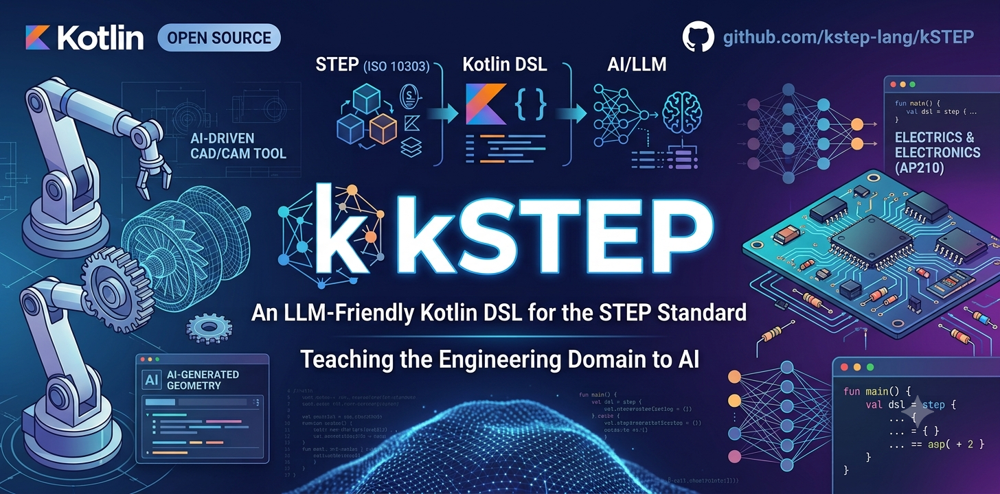

= kSTEP

Type-safe Kotlin DSL for the STEP standard (ISO 10303).

WARNING: kSTEP is in early, pre-release development (M1). The API is
unstable and no artifacts are published yet. See <<status,Status>> below
for what actually works today.

Licensed under the Apache License, Version 2.0. See link:LICENSE[LICENSE].

== Why kSTEP

LLMs are strong in popular, high-resource languages (Kotlin, Java, Python)
but measurably weak at generating external, low-resource DSLs — and STEP's
native exchange format (Part 21, graphs of `#123`-style entity references)
is a particularly hostile one to read or write directly.

kSTEP applies **Typed Domain Grounding (TDG)** — the pattern already
validated by its sibling project, https://github.com/kuml-dev/kUML[kUML]:
expose a domain as a type-safe, embedded Kotlin DSL with semantic
validation and structured errors, so that both human developers and LLM
agents can work in it reliably. The syntax stays Kotlin (high-resource);
only the vocabulary is domain-specific, enforced by the type system. A
strict type system, a compiler, and structured validation errors form a
feedback loop the LLM can act on directly, without a separate benchmark
or fine-tuning step. kSTEP compiles that DSL down to the neutral,
standardized ISO 10303 exchange format.

== Vision

kSTEP is not "just another CAD tool." The ambition is to cover the
**entire STEP standard (ISO 10303)** — CAD is the entry point, not the
boundary. STEP spans far more than mechanical geometry: manufacturing
(STEP-NC), electrical and electronics (assemblies, PCBs, wiring),
kinematics, composites, FEM/simulation, and plant/process data are all
part of the standard, each carved out as its own Application Protocol
(AP242, AP238, AP210, AP209, and others). Those APs are the building
blocks kSTEP intends to grow into over time.

The CAD market today splits into two camps: classic CAD suites
(SolidWorks, CATIA, Siemens NX, Fusion 360, Inventor, Onshape) — GUI-
centric, click-based, proprietary formats, AI bolted on after the fact —
and code-first CAD (OpenSCAD, CadQuery, Build123d, Replicad, JSCAD) —
scriptable and Git-friendly, but niche and without real AI integration.
kSTEP is the deliberate third way: code-first like the second camp,
AI-first like neither camp, and STEP-native instead of proprietary. It
is the same thesis as its sibling project
https://github.com/kuml-dev/kUML[kUML] in the UML/SysML space, applied
across the full breadth of engineering rather than just software
architecture — kUML covers the IT domain, kSTEP covers the engineering
domain, both grounded in the same Typed Domain Grounding (TDG)
principle described above.

V1 deliberately starts narrow — a single Application Protocol (AP242),
scoped down to product structure and metadata with no geometry and no
PMI (see <<roadmap,Roadmap>> below and kSTEP-ADR-0001) — but the
architecture is meant to carry the wider vision from the start, not to
box it in.

[#status]
== Status

The project bootstrapped its Gradle module skeleton and the EXPRESS
grammar integration (M1, first wave). Concretely, as of this writing:

* An ANTLR4-based parser for the EXPRESS schema language (ISO 10303-11)
  exists and successfully parses a hand-written AP242-subset fixture in
  `kstep-tests`.
* No semantic model, no EXPRESS-to-Kotlin code generation, no Part 21
  reader/writer, and no CLI commands exist yet — `kstep-core`,
  `kstep-step21`, and the CLI are placeholder skeletons.

See <<roadmap,Roadmap>> for what's planned next.

== Modules

|===
| Module | Purpose | Current state

| `kstep-core`
| Core DSL types (schema-independent runtime support for the generated
  Kotlin DSL)
| Empty skeleton — no source yet

| `kstep-express`
| ANTLR4-generated parser for the EXPRESS schema language (ISO 10303-11),
  wrapped by `dev.kstep.express.ExpressParserFactory`
| Working: parses EXPRESS source into an ANTLR parse tree, throws
  `ExpressSyntaxException` on the first syntax error

| `kstep-step21`
| STEP Part 21 (physical file exchange format) reader/writer
| Empty skeleton — no source yet

| `kstep-cli`
| Command-line entry point (`dev.kstep.cli.MainKt`)
| Placeholder `main()` only, no real commands yet

| `kstep-tests`
| Cross-module integration tests (Kotest)
| One smoke test parsing a hand-written AP242-subset EXPRESS fixture
|===

== Building

Requires JDK 21. The Gradle wrapper pins Gradle 9.6.1.

[source,shell]
----
./gradlew clean check
----

`check` runs ktlint and the Kotest test suite (currently just the
`kstep-express` smoke test in `kstep-tests`).

== Usage (current capability)

The only thing usable end-to-end today is parsing an EXPRESS schema
into an ANTLR parse tree:

[source,kotlin]
----
import dev.kstep.express.ExpressParserFactory

val schema = """
    SCHEMA example_schema;
      ENTITY product;
        id   : STRING;
        name : STRING;
      END_ENTITY;
    END_SCHEMA;
""".trimIndent()

val tree = ExpressParserFactory.parse(schema)
println(tree.schemaDecl().size) // 1
----

`ExpressParserFactory.parse` throws `ExpressSyntaxException` on the
first syntax error instead of returning a partial tree. There is no
semantic model or code generation on top of the parse tree yet — that
is the next wave of work.

[#roadmap]
== Roadmap (V1 scope)

Per the project's scope-reduction decision (kSTEP-ADR-0001, analogous to
kUML-ADR-0004), V1 deliberately excludes B-rep geometry and PMI, and
focuses on a semantic core that a type-safe DSL benefits from most:

. EXPRESS parser (done, see above) + EXPRESS-to-Kotlin code generation,
  driven off the official AP242 schemas.
. A semantic AP242 core: product structure and metadata, without
  B-rep geometry and without PMI (PMI references geometry shape
  aspects and moves with the geometry milestone).
. Validation: EXPRESS `WHERE` rules surfaced as structured errors.
. STEP Part 21 export/import, with a lossless roundtrip through
  external CAD/PLM tools as the acceptance criterion.
. An MCP server and an LLM benchmark comparing raw STEP, CadQuery, and
  the kSTEP DSL as generation targets.
. Later: geometry via an OpenCascade (OCCT) bridge, additional STEP
  Application Protocols as needed.

== License and attribution

kSTEP is licensed under the Apache License, Version 2.0 — see
link:LICENSE[LICENSE].

The bundled EXPRESS grammar
(`kstep-express/src/main/antlr/dev/kstep/express/grammar/Express.g4`)
is vendored from https://github.com/lutaml/express-grammar[lutaml/express-grammar]
and is BSD-2-Clause licensed (Ribose Inc.); see link:NOTICE[NOTICE] for
full attribution.
